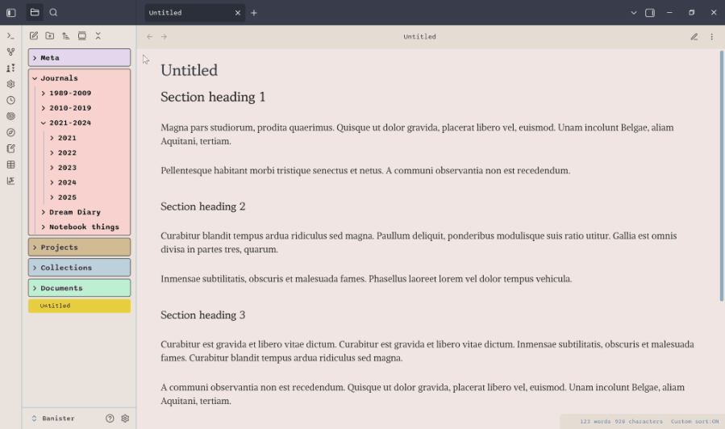
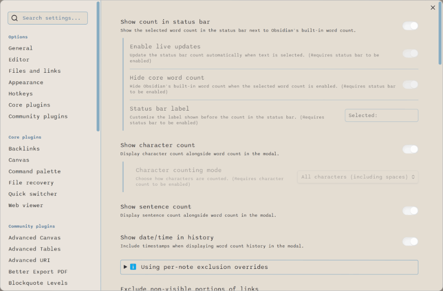
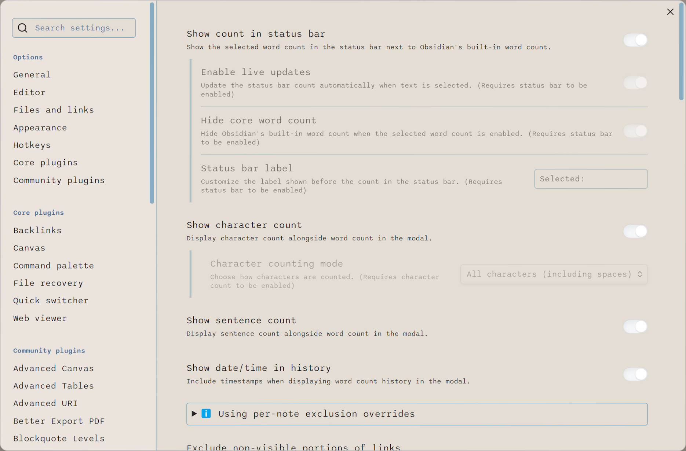
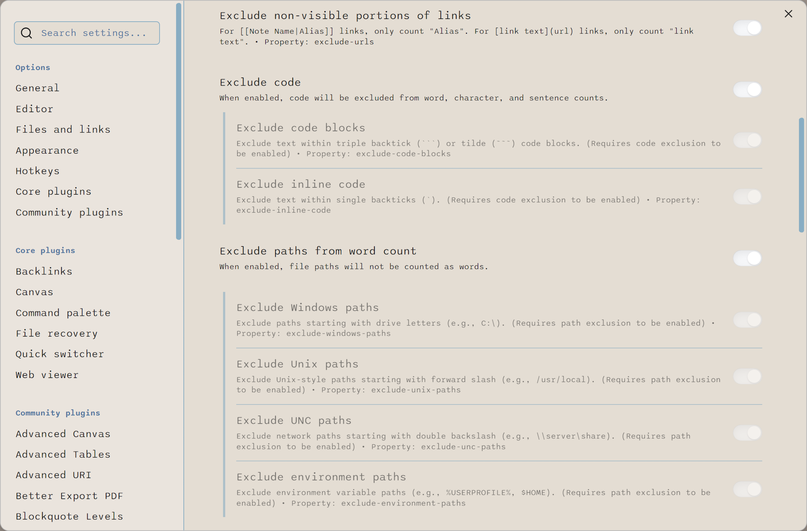
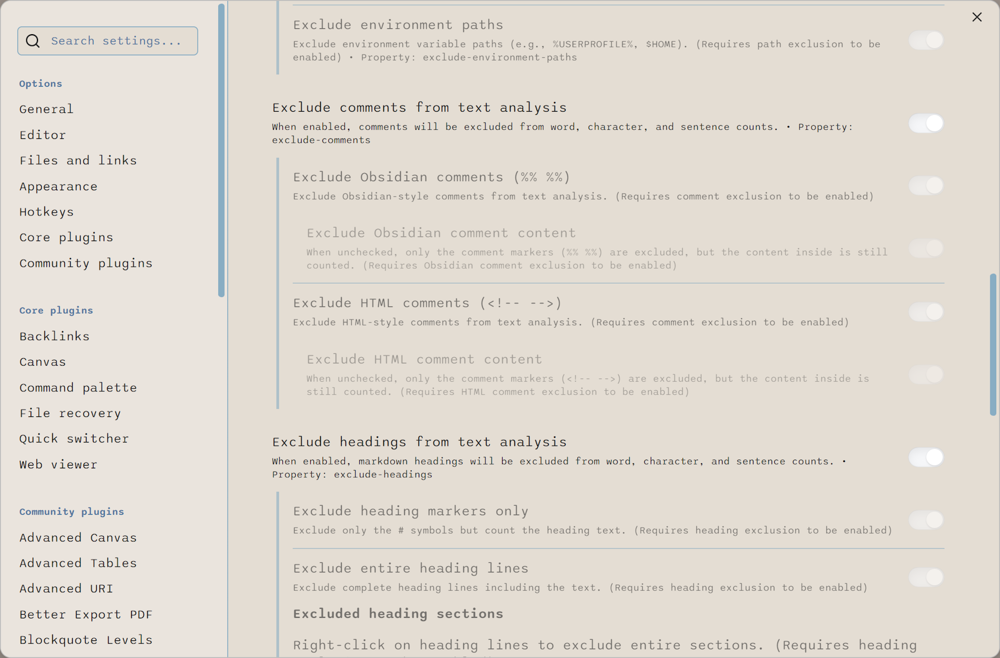
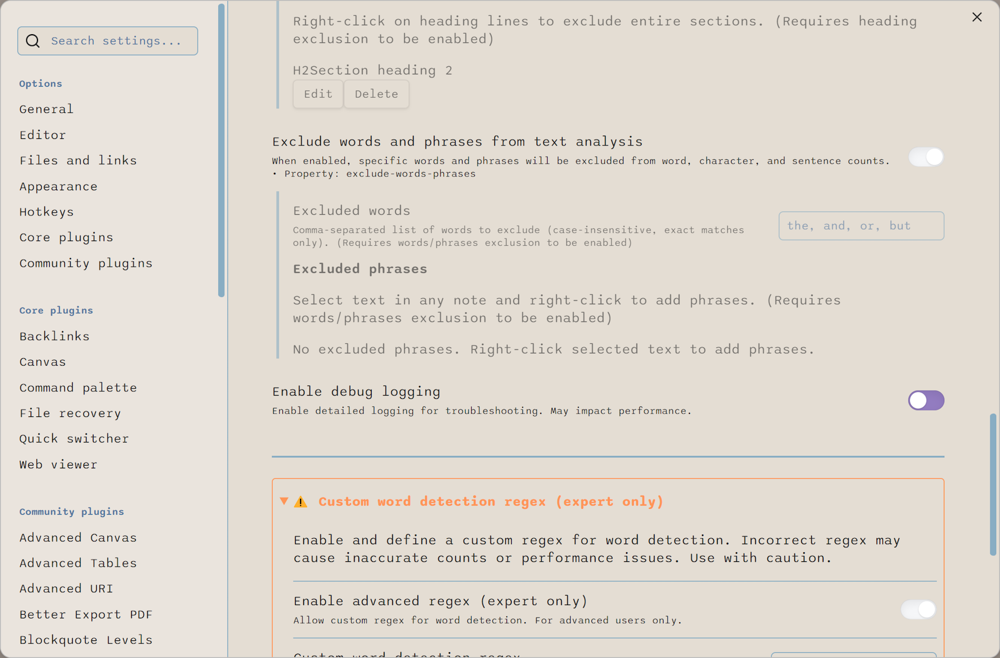
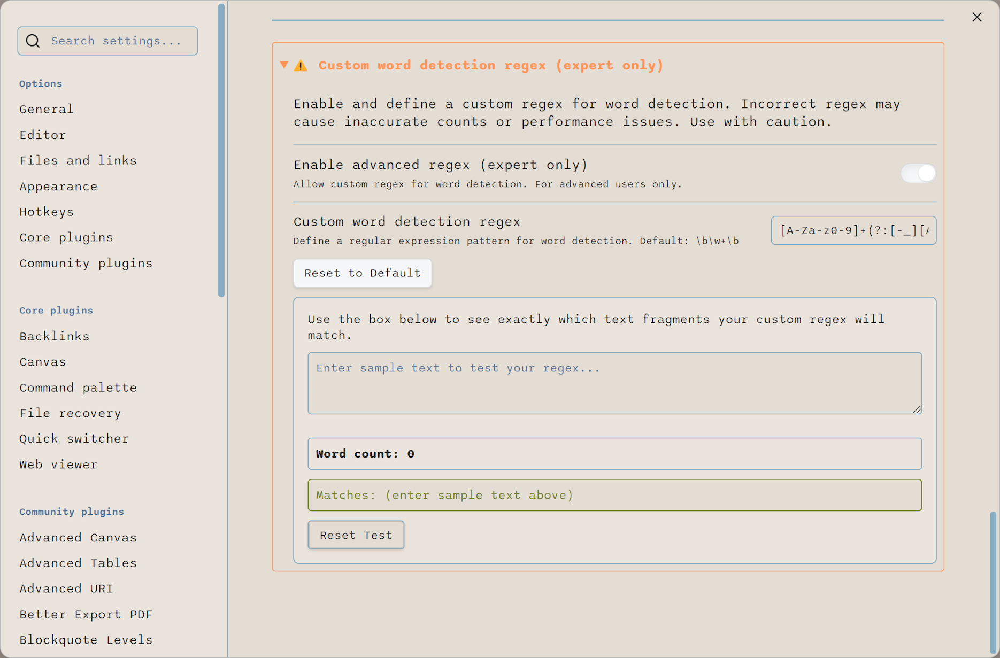

# Custom Selected Word Count for Obsidian

A plugin for [Obsidian](https://obsidian.md) that provides comprehensive text analysis for selected text across all view modes. Features advanced word counting, character counting, and sentence counting with customizable path exclusion, modern UI design, and detailed history tracking.

## Plugin in Action

See the Custom Selected Word Count plugin in active use, demonstrating how it provides real-time feedback in your editor.

<p align="center">
  
</p>
<p align="center">
  <em>Selecting text automatically displays the word count in the status bar, with live updates as you adjust your selection.</em>
</p>

## Settings Overview

This animated overview showcases the various configuration options available within the Custom Selected Word Count plugin.

<p align="center">
  
</p>
<p align="center">
  <em>Explore the comprehensive settings, from basic display options to advanced exclusion rules.</em>
</p>

---

## Features

### Text Analysis
- **Advanced word counting** of selected text in all view modes (Source, Live Preview, and Reading)
- **Character counting** with configurable modes:
  - All characters (including spaces and punctuation)
  - All characters excluding spaces
  - Letters only (alphabetic characters)
- **Sentence counting** with sophisticated detection:
  - Advanced boundary detection for periods, exclamation marks, and question marks
  - Smart handling of abbreviations (Mr., Dr., Prof., etc.)
  - Context-aware processing that excludes decimal numbers and file extensions
  - Markdown-aware processing for code blocks and headers

### User Interface
- **Modern card-based modal design** with professional monochrome styling
- Individual copy buttons for each metric (words, characters, sentences)
- **Multi-metric history tracking** with comprehensive display
- Command palette integration
- Optional status bar integration showing live word count
- Optional ribbon button for quick access
- Customizable status bar label

---

## Detailed Configuration & Screenshots

For a comprehensive look at all of the plugin's settings and how they are presented, refer to the screenshots below:

| Screenshot | Description |
| :--------- | :---------- |
|  | **Status bar:** Show count in status bar, Enable live updates, Hide core wordcount, Status bar label<br />**Modal**: Show character count, Character counting mode, show sentence count, Show date/time in history |
|  | **Code:** Exclude code, Exclude code blocks, Exclude inline code<br />**Paths:**<br />Exclude paths from word count, Exclude Windows paths, Exclude Unix paths, Exclude UNC paths, Exclude environment paths |
|  | **Comments:** Exclude Obsidian comments, Exclude Obsidian comment content, Exclude HTML comments, Exclude HTML comment content<br />**Headings:** Exclude heading markers only, Exclude entire heading lines, Exclude heading sections |
|  | **Words and phrases:** Exclude words, Exclude phrases<br />**Logging:** Enable debug logging, Logging level (not shown)<br />**Custom word detection regex** |
|  | **Custom word detection regex** (continued) |

---

### Advanced Features
- **Link processing** for accurate text analysis:
  - For `[[Note Name|Alias]]` links, only count "Alias"
  - For `[link text](url)` links, only count "link text"
  - Excludes non-visible portions like URLs and file paths
- **Comment exclusion** with granular control:
  - Support for Obsidian comments (`%% comment %%`) and HTML comments (`<!-- comment -->`)
  - Option to exclude comment markers only or entire comments including content
  - Individual toggles for each comment type with separate content controls
- **Heading exclusion** with flexible options:
  - Exclude heading markers only (just the # symbols)
  - Exclude entire heading lines (complete headings)
  - Exclude entire heading sections (heading + content until next heading)
- **Words and phrases exclusion** for precise filtering:
  - Comma-separated word list with case-insensitive exact matching
  - Right-click phrase selection with context menu integration
  - Phrase management UI with edit/delete capabilities
- **Path and file extension exclusion** to avoid counting URLs and file paths
- **Per-note exclusion overrides**:
  - Override global exclusion settings for individual notes using YAML frontmatter
  - Use `cswc-disable` property to disable specific exclusions (e.g., `cswc-disable: [exclude-urls, exclude-comments]`)
  - Special value `all` disables all exclusions for the note
  - Inline comment overrides: Use `<!-- cswc-disable -->` or `%% cswc-disable %%` markers to disable exclusions for specific sections
- **Custom Word Detection Regex** (expert users):
  - Define your own regex pattern for word detection
  - Interactive "Test Your Regex" area with live preview
  - "Reset to Default Regex" and "Reset Test" buttons for experimentation
  - Helper texts guide you through safe usage
- **Flexible configuration** for each analysis type with persistent settings

## Installation

1. Open Obsidian Settings
2. Go to Community Plugins and disable Safe Mode
3. Click Browse and search for "Custom Selected Word Count"
4. Install the plugin
5. Enable the plugin in your list of installed plugins

## Usage

1. Select text in any view mode
2. Access the text analysis:
   - Use the command palette and search for "Count Selected Words"
   - Click the ribbon button (if enabled)
   - Click the status bar count (if enabled)
   - View the real time word count in the status bar (if enabled)
3. View comprehensive analysis in the modal:
   - Word count with advanced detection
   - Character count (if enabled in settings)
   - Sentence count (if enabled in settings)
   - Copy individual metrics to clipboard
   - View historical analysis data

## Support My Work

If you find this plugin useful, please consider supporting its development!

<a href="https://www.buymeacoffee.com/banisterious" target="_blank"></a>

## Documentation

For comprehensive documentation, visit the [Documentation Hub](docs/README.md) which includes:

- **[Getting Started Guide](docs/user/guides/getting-started.md)** - Detailed usage instructions and examples
- **[Settings Reference](docs/user/reference/settings-reference.md)** - Complete settings documentation
- **[Word Counting Principles](docs/user/concepts/word-counting-principles.md)** - How the plugin counts words
- **[Developer Documentation](docs/developer/architecture/overview.md)** - Technical specifications and architecture

### UI Elements
- **Show Ribbon Button**: Add a button to the ribbon menu for quick access (requires restart)
- **Show Count in Status Bar**: Display the word count in the status bar
  - **Enable Live Updates**: Update the count automatically when text is selected
  - **Hide Core Word Count**: Hide Obsidian's built-in word count (CSS-based)
  - **Status Bar Label**: Customize the label shown before the count

### Character Counting
- **Show Character Count**: Display character count alongside word count in the modal
- **Character Counting Mode**: Choose how characters are counted:
  - All characters (including spaces)
  - All characters (excluding spaces)
  - Letters only

### Sentence Counting
- **Show Sentence Count**: Display sentence count alongside word count in the modal

### Link Processing
- **Exclude Non-visible Portions of Links**: Count only visible text in markdown links (**disabled by default**)
  - For `[[Note Name|Alias]]` links, only count "Alias"
  - For `[link text](url)` links, only count "link text"
  - Excludes URLs, file paths, and technical markup from word counting

### Exclude Comments
- **Exclude Comments from Text Analysis**: Master toggle for comment exclusion (**disabled by default**)
  - **Exclude Obsidian Comments (`%% comment %%`)**: Skip Obsidian-style comments (**disabled by default**)
    - **Exclude Obsidian Comment Content**: When unchecked, only comment markers are excluded (**disabled by default**)
  - **Exclude HTML Comments (`<!-- comment -->`)**: Skip HTML-style comments (**disabled by default**)
    - **Exclude HTML Comment Content**: When unchecked, only comment markers are excluded (**disabled by default**)

### Exclude Headings
- **Exclude Headings from Text Analysis**: Master toggle for heading exclusion (**disabled by default**)
  - **Exclude Heading Markers Only**: Remove only the # symbols but count heading text (**disabled by default**)
  - **Exclude Entire Heading Lines**: Remove complete heading lines including text (**disabled by default**)
  - **Excluded Heading Sections**: Selectively exclude specific heading sections via right-click context menu
    - Right-click on heading lines → "Exclude heading section from word count"
    - Heading management UI with edit/delete buttons showing heading levels (H1, H2, etc.)
    - Inline editing with keyboard shortcuts (Enter to save, Escape to cancel)
  
*Note: Heading markers and lines are mutually exclusive modes. Heading sections work independently.*

### Exclude Words and Phrases
- **Exclude Words and Phrases from Text Analysis**: Master toggle for custom word/phrase exclusion (**disabled by default**)
  - **Excluded Words**: Comma-separated list (e.g., "the, and, or, but") with case-insensitive exact word matching
  - **Excluded Phrases**: Managed via right-click context menu on selected text
    - Select text → Right-click → "Exclude phrase from word count" (only available when feature enabled)
    - Phrase management UI with individual edit/delete buttons for each phrase
    - Inline editing with keyboard shortcuts (Enter to save, Escape to cancel)
    - Automatic duplicate detection and settings navigation

### Path Exclusion
- **Exclude Paths from Word Count**: Toggle path exclusion (**disabled by default**)
  - **Exclude Windows Paths**: Skip Windows-style paths (`C:\`) (**disabled by default**)
  - **Exclude UNC Paths**: Skip network paths (`\\server`) (**disabled by default**)
  - **Exclude Unix Paths**: Skip Unix-style paths (`/usr/local`) (**disabled by default**)
  - **Exclude Environment Paths**: Skip paths with environment variables (**disabled by default**)

### Advanced: Custom Word Detection Regex (Expert Only)
- **Enable Advanced Regex**: Allow defining a custom regex for word detection
- **Custom Regex Pattern**: Enter your own regex pattern (default provided)
- **Reset to Default Regex**: Instantly revert to the default pattern (with helper text)
- **Test Your Regex**: Enter sample text to see which fragments your regex matches and the resulting word count
- **Reset Test**: Clear the test input box
- Helper texts explain each feature and guide you through safe usage

### Other Settings
- **Show Date/Time in History**: Include timestamps in modal word count history
- **Enable Debug Logging**: Enable detailed console logging for troubleshooting

## Exclusion Logic Details

The settings page now includes a detailed "Exclusion Logic Details" section. For each exclusion type (Windows Paths, UNC Paths, Unix Paths, Environment Variable Paths, File Extension Exclusion, `file:///` Protocol), you will see:

- The regex pattern used
- A plain-English explanation
- Example matches and non-matches
- A "Copy Regex" button for advanced users
- All details are in a collapsible section for clarity

This makes it easy to understand what is being excluded and why.

## Per-Note Exclusion Overrides

You can override global exclusion settings for individual notes using two methods:

### YAML Frontmatter Override

Add a `cswc-disable` property to your note's frontmatter:

```yaml
---
cswc-disable: [exclude-urls, exclude-comments]
---
```

Or disable all exclusions:

```yaml
---
cswc-disable: all
---
```

### Inline Comment Override

Use special comments to disable exclusions for specific sections:

```markdown
This text follows global exclusion rules.

<!-- cswc-disable -->
This section ignores all exclusions - URLs, paths, and comments are counted.
<!-- cswc-enable -->

Back to normal exclusion rules.
```

You can also use Obsidian comment syntax: `%% cswc-disable %%` and `%% cswc-enable %%`.

## Support

If you encounter any issues or have a feature request, please create a [GitHub issue](https://github.com/yourusername/obsidian-selected-word-counter/issues).

## Mobile Compatibility

This plugin is primarily developed and tested for Obsidian Desktop. While it may work on Obsidian Mobile, mobile support is currently untested. Some features—such as the ribbon button and status bar integration—are not available on mobile. If you use this plugin on mobile and encounter any issues or have suggestions, please report them on GitHub. Your feedback is appreciated and will help improve mobile compatibility in future updates.

## License

[MIT License](LICENSE.md) 