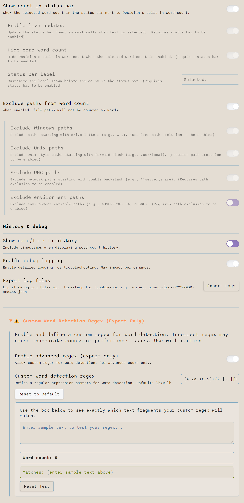

# Custom Selected Word Count for Obsidian

A plugin for [Obsidian](https://obsidian.md) that provides comprehensive text analysis for selected text across all view modes. Features advanced word counting, character counting, and sentence counting with customizable path exclusion, modern UI design, and detailed history tracking.

## Features

### Text Analysis
- **Advanced word counting** of selected text in all view modes (Source, Live Preview, and Reading)
- **Character counting** with configurable modes:
  - All characters (including spaces and punctuation)
  - All characters excluding spaces
  - Letters only (alphabetic characters)
- **Sentence counting** with sophisticated detection:
  - Advanced boundary detection for periods, exclamation marks, and question marks
  - Smart handling of abbreviations (Mr., Dr., Prof., etc.)
  - Context-aware processing that excludes decimal numbers and file extensions
  - Markdown-aware processing for code blocks and headers

### User Interface
- **Modern card-based modal design** with professional monochrome styling
- Individual copy buttons for each metric (words, characters, sentences)
- **Multi-metric history tracking** with comprehensive display
- Command palette integration
- Optional status bar integration showing live word count
- Optional ribbon button for quick access
- Customizable status bar label

### Advanced Features
- **Path and file extension exclusion** to avoid counting URLs and file paths
- **Custom Word Detection Regex** (expert users):
  - Define your own regex pattern for word detection
  - Interactive "Test Your Regex" area with live preview
  - "Reset to Default Regex" and "Reset Test" buttons for experimentation
  - Helper texts guide you through safe usage
- **Flexible configuration** for each analysis type with persistent settings

## Installation

1. Open Obsidian Settings
2. Go to Community Plugins and disable Safe Mode
3. Click Browse and search for "Custom Selected Word Count"
4. Install the plugin
5. Enable the plugin in your list of installed plugins

## Usage

1. Select text in any view mode
2. Access the text analysis:
   - Use the command palette and search for "Count Selected Words"
   - Click the ribbon button (if enabled)
   - Click the status bar count (if enabled)
   - View the real time word count in the status bar (if enabled)
3. View comprehensive analysis in the modal:
   - Word count with advanced detection
   - Character count (if enabled in settings)
   - Sentence count (if enabled in settings)
   - Copy individual metrics to clipboard
   - View historical analysis data

## Support My Work

If you find this plugin useful, please consider supporting its development!

## Documentation

For comprehensive documentation, visit the [Documentation Hub](docs/README.md) which includes:

- **[Getting Started Guide](docs/user/guides/getting-started.md)** - Detailed usage instructions and examples
- **[Settings Reference](docs/user/reference/settings-reference.md)** - Complete settings documentation
- **[Word Counting Principles](docs/user/concepts/word-counting-principles.md)** - How the plugin counts words
- **[Developer Documentation](docs/developer/architecture/overview.md)** - Technical specifications and architecture

## Settings

  

<em>Settings interface (click to enlarge)</em>

### UI Elements
- **Show Ribbon Button**: Add a button to the ribbon menu for quick access (requires restart)
- **Show Count in Status Bar**: Display the word count in the status bar
  - **Enable Live Updates**: Update the count automatically when text is selected
  - **Hide Core Word Count**: Hide Obsidian's built-in word count (CSS-based)
  - **Status Bar Label**: Customize the label shown before the count

### Character Counting
- **Show Character Count**: Display character count alongside word count in the modal
- **Character Counting Mode**: Choose how characters are counted:
  - All characters (including spaces)
  - All characters (excluding spaces)
  - Letters only

### Sentence Counting
- **Show Sentence Count**: Display sentence count alongside word count in the modal

### Path Exclusion
- **Exclude Paths from Word Count**: Toggle path exclusion (**disabled by default**)
  - **Exclude Windows Paths**: Skip Windows-style paths (C:\) (**disabled by default**)
  - **Exclude UNC Paths**: Skip network paths (\\server) (**disabled by default**)
  - **Exclude Unix Paths**: Skip Unix-style paths (/usr/local) (**disabled by default**)
  - **Exclude Environment Paths**: Skip paths with environment variables (**disabled by default**)

### Advanced: Custom Word Detection Regex (Expert Only)
- **Enable Advanced Regex**: Allow defining a custom regex for word detection
- **Custom Regex Pattern**: Enter your own regex pattern (default provided)
- **Reset to Default Regex**: Instantly revert to the default pattern (with helper text)
- **Test Your Regex**: Enter sample text to see which fragments your regex matches and the resulting word count
- **Reset Test**: Clear the test input box
- Helper texts explain each feature and guide you through safe usage

### Other Settings
- **Show Date/Time in History**: Include timestamps in word count history
- **Enable Debug Logging**: Enable detailed console logging for troubleshooting

## Exclusion Logic Details (New in Settings)

The settings page now includes a detailed "Exclusion Logic Details" section. For each exclusion type (Windows Paths, UNC Paths, Unix Paths, Environment Variable Paths, File Extension Exclusion, file:/// Protocol), you will see:

- The regex pattern used
- A plain-English explanation
- Example matches and non-matches
- A "Copy Regex" button for advanced users
- All details are in a collapsible section for clarity

This makes it easy to understand what is being excluded and why.

**UI improvement:** The sub-settings for "Exclude Paths" are now indented to match the style of the "Show Count in Status Bar" children, for a more consistent and visually appealing settings page.

## Support

If you encounter any issues or have feature requests, please file them in the [GitHub issues](https://github.com/yourusername/obsidian-selected-word-counter/issues).

## Mobile Compatibility

This plugin is primarily developed and tested for Obsidian Desktop. While it may work on Obsidian Mobile, mobile support is currently untested. Some features—such as the ribbon button and status bar integration—are not available on mobile. If you use this plugin on mobile and encounter any issues or have suggestions, please report them on GitHub. Your feedback is appreciated and will help improve mobile compatibility in future updates.

## License

[MIT License](LICENSE.md) 
